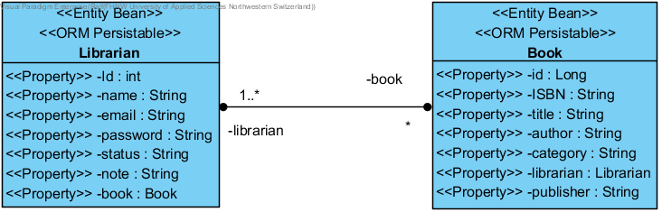

### API-Library
API Library Search Engine for Employees:

The employee (librarian) has a user ID and a password to login to the application (part of ERP). The
librarian can search existing books stored in the database. Books can be search by name, author, title,
publisher, or ISBN. Users are able to add, delete or edit books. The engine also provides a 
filter function which filters by attributes such as author. The user also can update his status. 
User can look up other user.

UC1: Employee login to library application 

UC2: User can search for an existing book in library.

UC3: User can modify entries. 

UC4: User can use a filter function.

UC5: Employee is able to set and update his status to inform other users about the current status.

UC6: User can check status of other User. 

**Use Case Diagram:** 

**Data Access / Persistence Layer**

**Business Layer**

